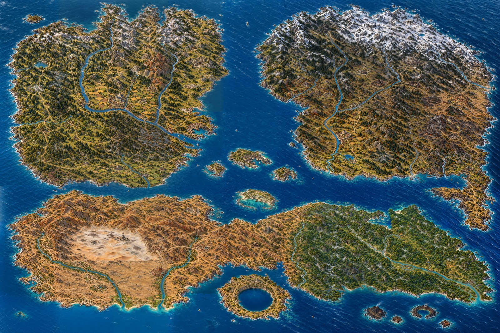

# Create a world with an agent

**An agent-led map-making experiment for GPT-6 Astra with reasoning set to High.**

Describe the world you have in mind. Your agent helps you find its art style, plan the land and its people, and paint the map through a sequence of reviewed regions. You steer the creative direction; the agent manages the skills, files, image tools and rendering work.

*An overview from the original Lantern Sea experiment. The shared skills carry forward its woodland, settlement and painting lessons. [Provenance and review limits](showcase/README.md).*

## Start here

1. **Get this folder and open it in Codex.** Use the repository's folder-only checkout instructions, or download the repository ZIP and open `map_creation` as your project. Keep its hidden `.agents` and `.codex` folders.
2. **Select GPT-6 Astra and High reasoning for the task.** These are the required settings for this experiment. The included project configuration supplies these defaults where supported; check the task's actual settings before starting. See [setup](docs/setup.md).
3. **Give the agent access to image generation and editing.** It also needs to read/write project files and inspect images. The agent checks these capabilities and sets up any helper dependencies it needs.
4. **Paste the starting prompt below.** You can begin with a rough idea, existing setting notes or a reference image. You do not need to install Python or run the helper commands yourself to start the conversation.

## Your first message

Type `$map-director` and describe your world:

> $map-director I want a cold coastal world with three competing port cities and a large, quiet interior. Help me find the style first.

The director skill reads the rest for itself: it checks the required model settings, leads you from a short brief through art-style trials, geography, populations, factions, a painted pilot region, expansion and final review, handles the project files and image-tool calls, asks you only for the creative choices and budget decisions that matter, and saves your decisions so you can resume later.

If `$map-director` does not appear in your client, paste this instead:

> Read .agents/skills/map-director/SKILL.md and follow it to guide me through creating my own fantasy map. My starting idea is: [describe your world, or help me find one].

Instructions cannot switch the task's model by themselves; select **GPT-6 Astra / High** in your client.

## What working with the agent looks like

| You contribute | The agent does |
| --- | --- |
| An idea, references, tone and intended use | Turns the conversation into a short brief and a workable scope. |
| Feedback on a few style trials | Establishes a consistent camera, palette, light and level of detail. |
| The people, powers and journeys that interest you | Plans geography, settlement roles, population assumptions and faction relationships. |
| Feedback on the first painted region | Checks terrain, woodland, buildings, river crossings and visual cohesion before expansion. |
| Direction on what to change or explore next | Paints adjoining regions, checks connections, repairs defects and saves progress. |
| Your intended audience and deliverables | Prepares clean artwork, editable labels, safe previews and release notes. |

For example: “I want a cold coastal world with three competing port cities and a large, quiet interior. Help me find the style first.” You can later say: “The towns feel too grand; make ordinary life more visible,” or “Continue from the last accepted region and keep the river unchanged.”

Follow the [conversation walkthrough](docs/walkthrough.md) for examples from the first idea to delivery. The [production arc](docs/workflow.md) explains what the agent tracks along the way.

## The skills behind the process

The director brings in the relevant skill as work progresses. You can also request a focused task directly.

| Skill | What it helps the agent do |
| --- | --- |
| `map-director` | Guide the whole project and resume from saved decisions. |
| `map-art-direction` | Compare visual directions and establish a style reference. |
| `map-world-planning` | Connect geography, travel, population and political space. |
| `lantern-forest` | Compose coherent habitats, varied canopy and woodland edges. |
| `lantern-village` | Design settlements with usable routes, shared spaces and signs of life. |
| `map-render` | Drive painting, native inspection, local repairs and recorded acceptance. |
| `map-release` | Prepare artwork, labels, previews and a public-safe handoff. |

The Lantern skills are portable adaptations of the original experiment. All seven skills, their references and templates live in this folder. The private setting and original asset library are not required.

## What to expect

This is an iterative creative workflow. The agent uses an image tool to paint; GPT-6 Astra directs the work and reviews results. Rivers, gates and buildings can still need correction. Start with one representative region and agree a generation budget before expanding.

The agent retains decisions, sources and review records so you can revise or resume. You can ask it to start from scratch or explore **Bracken Reach**, the included fictional example. The example's schematic guide demonstrates planning; it is not the painted atlas shown above.

## Supporting material

The Python scripts are supporting tools the agent can use for small-map guides, image bookkeeping, masks and exports. Command-line setup and the offline demo are documented separately for agents and readers who want to inspect the implementation.

- [Agent setup and required model](docs/setup.md)
- [Start a map or bring an existing setting](docs/start-here.md)
- [What the original experiment taught us](docs/case-study.md)
- [Technical helper reference](docs/tools.md) · [Optional offline demo](docs/offline-demo.md)
- [Large-map production limits](docs/scaling.md) · [Verification record](docs/verification.md)
- [Release preparation](docs/releasing.md) · [Reuse terms](LICENSE.md) · [Credits](CREDITS.md)

Keep the whole folder together when sharing it. The agent can prepare a standalone ZIP using the included packager. Working worlds and private writing stay outside that public archive.
