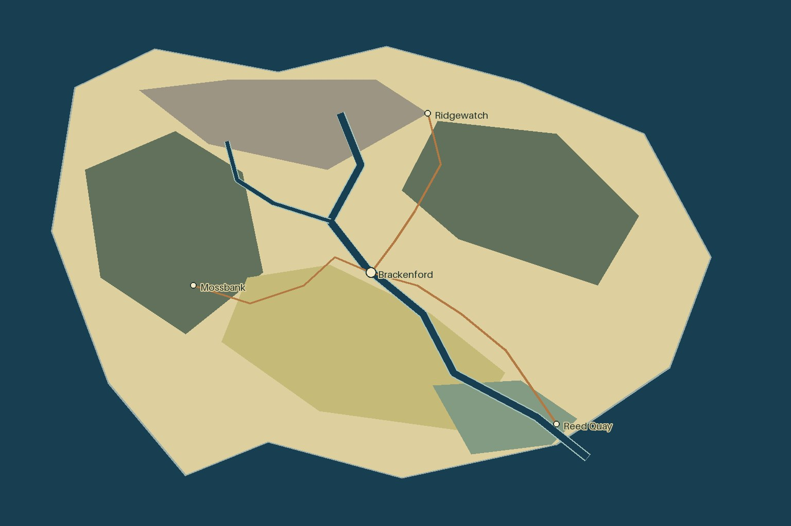

# Bracken Reach

An original fictional teaching example, written for this public kit. Its schematic map intentionally leaves painting, settlement silhouettes and native crossing geometry to the pilot. It contains no hidden plot material and is independent of the source atlas.

The northern Ridge Council trades stone and upland livestock for grain. The Ford Charter maintains the main crossing and lower-valley markets. The Wood Commons manages western clearings and timber rights. River Carriers operate across these boundaries rather than occupying a fourth country.

The four population figures are illustrative planning assumptions, not capacity estimates: Ridgewatch 900, Brackenford 3,200, Mossbank 240, Reed Quay 650. These are named settlement populations, not total regional population. A future author can add dispersed residents, household occupancy, agricultural land and imports to a demographic model.

The Bracken River runs from the northern upland to the southeast sea; Alder Brook joins it. Roads connect planned site anchors, but their guide lines do not yet contain painted bridges or doorways. Check the wood-road crossing at the ford carefully in the pilot. The helper does not prove that slopes, coast contact, political reach or population supply are correct.

Run the README quickstart to reproduce the guide. The preview is a deterministic schematic produced by `scripts/mapkit.py`, not an image-generation result or an accepted painting. See the [walkthrough](../../docs/walkthrough.md) to move from this plan into artwork.
