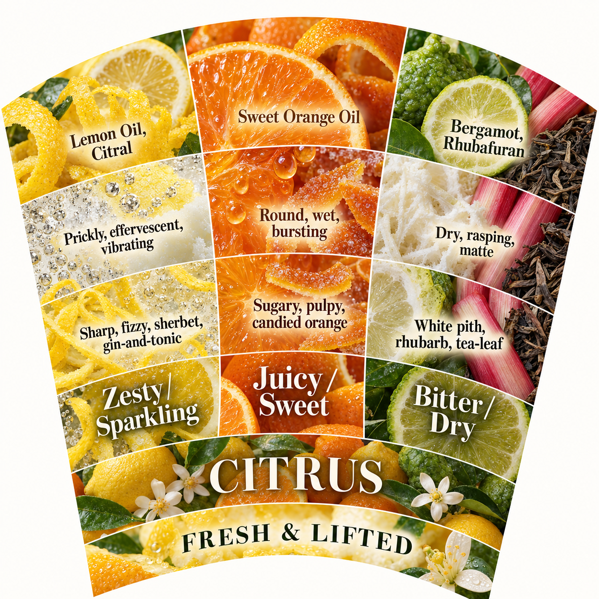

# Olfactory taxonomy

Can a photographic sunburst help people describe scents through a consistent vocabulary of notes, descriptors and tactile qualities?

This experiment develops a large illustrated guide from a 48-note taxonomy. It currently contains the source data, original visual reference, a generated Citrus style proof, and a reproducible angular layout manifest. The complete chart and production tiles have not yet been built.



## Quickstart

Requires Python 3.10 or newer. There are no third-party Python dependencies, no install step and no API key requirement for the local layout tool.

From this folder:

```sh
python3 scripts/build_layout.py
```

Expected result: validation of 48 notes, four realms, 20 realm-scoped families, and 7.5° per note, followed by creation of `build/layout.json`. The tool works when this whole folder is copied elsewhere. To use a different destination:

```sh
python3 scripts/build_layout.py --output build/alternate-layout.json
```

## Contents

| Path | Purpose |
| --- | --- |
| [data/taxonomy.json](data/taxonomy.json) | Authoritative transcription of all 48 source rows |
| [references/olfactive-taxonomy-original.jpg](references/olfactive-taxonomy-original.jpg) | Original unfinished chart, unchanged |
| [examples/citrus-visual-proof.png](examples/citrus-visual-proof.png) | Generated visual demonstration |
| [prompts/citrus-visual-proof.txt](prompts/citrus-visual-proof.txt) | Full prompt and generation mode |
| [scripts/build_layout.py](scripts/build_layout.py) | Data checks and angular layout generation |
| [PROVENANCE.md](PROVENANCE.md) | Sources, limitations and reuse terms |

## Chart structure

Six concentric rings run from inside to outside: **Realm → Family → Note → Descriptors → Texture/tactile → Reference material**. The central title is separate. Every note has weight 1, giving 48 equal 7.5° sectors.

| Realm | Notes | Arc |
| --- | ---: | ---: |
| FRESH & LIFTED | 13 | 97.5° |
| AMBER, SPICE & SWEET | 12 | 90° |
| FLORAL & FRUITY | 11 | 82.5° |
| EARTHY, WOODY & DEEP | 12 | 90° |

The initial manifest follows table order clockwise from 12 o'clock. This is a documented starting convention, not a reconstruction of the draft image's ordering. A family is identified within its realm; the two TOBACCO branches remain separate. Descriptors, textures and materials stay associated with their note rather than becoming independently weighted branches.

## Artwork and tiles

Use the built-in image generation tool with the original chart as a style reference to develop photographic assets. The included Citrus prompt demonstrates the established direction. Keep exact boundaries and editable typography in a shared master layout, then clip imagery into its cells.

For the finished large-format chart, derive export tiles from that one master coordinate system. Overlap, bleed and alignment marks will be determined once the physical diameter and print or digital destination are selected. Independently generated wedge outlines are not reliable alignment templates.

Next decisions: finished diameter, print versus digital use, ring radii, typography, tile dimensions and overlap. Next implementation: create the exact editable master, develop coordinated artwork for the remaining families, and verify labels and joins before producing exports.

## Verification and limitations

The layout tool checks row count, required fields, unique note paths, equal weights, realm counts and contiguous realm/family groups. Its manifest includes realm, family and note boundaries covering 360°. It does not render a chart or verify print legibility.

The supplied table takes precedence over the original image. The proof's geometry is illustrative, and labels will be typeset separately for production. No finished-size, resolution or seamless-assembly claim is made.

Setup verification on 2026-10-03: the quickstart passed from a fresh standalone copy; realm, family and note arcs each covered 360° without gaps; the two Tobacco branches stayed separate; and local Markdown links resolved. Image dimensions were checked: original reference 4725 × 4715 pixels, Citrus proof 1254 × 1254 pixels.

See [PROVENANCE.md](PROVENANCE.md) for attribution and reuse terms. No redistribution license has been selected.
