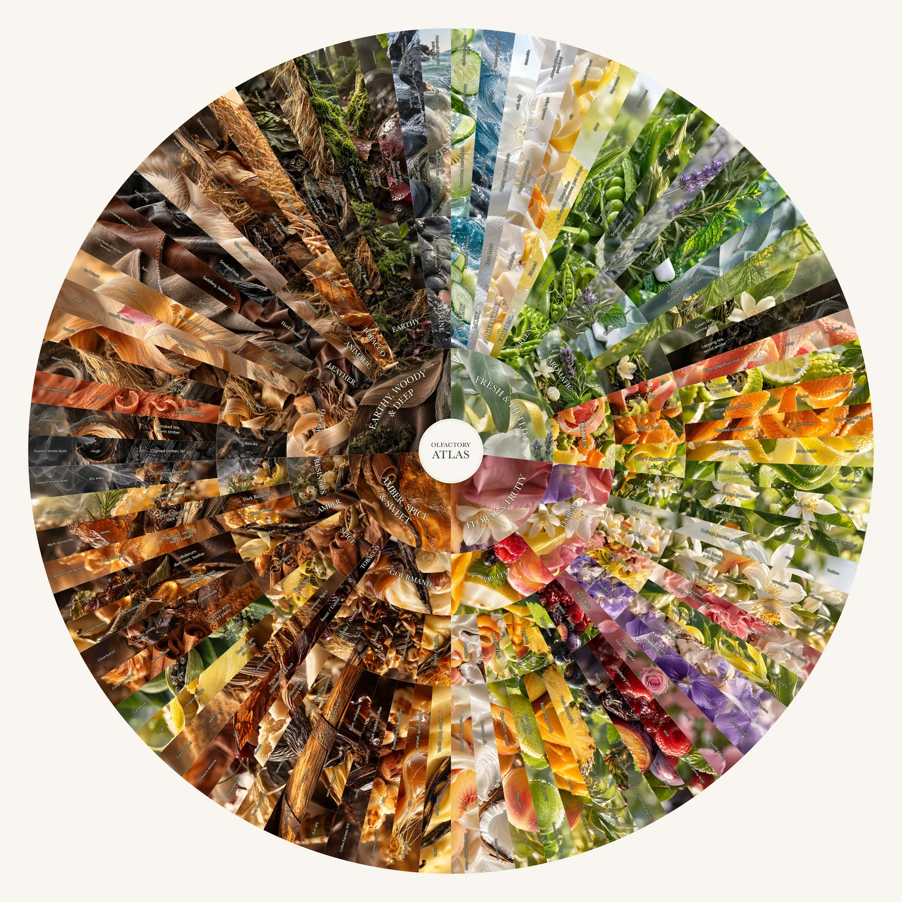

# Olfactory Atlas

A photographic vocabulary for describing scent: **20 families, 82 scent possibilities, 318 labels and 130 image compositions**. Follow a familiar impression toward more specific comparisons, feel words and study references.



## Explore

The exhibit is included in this folder. No install, API key, account or build step is needed. From this folder, run:

```sh
python3 -m http.server 8000 --bind 127.0.0.1
```

Open **http://127.0.0.1:8000/**. Drag to pan, scroll or pinch to zoom, and choose a family to focus. **Reading size** shows native detail; **Fit** returns to the selected overview. The text toggle reveals the photography. With the wheel focused, use arrows, +/−, 0 (fit) and 1 (reading size).

The viewer uses local WebP tiles and works without internet after cloning. It needs HTTP rather than a `file://` URL. The standalone image below opens without a server.

To clone only this experiment from the collection:

```sh
git clone --depth 1 --filter=blob:none --sparse https://github.com/ryannel/experiments.git
cd experiments
git sparse-checkout set olfactory_taxonomy
cd olfactory_taxonomy
python3 -m http.server 8000 --bind 127.0.0.1
```

## Image and originals

| Edition | Purpose | Location |
| --- | --- | --- |
| Full-size AVIF, 9,216 × 9,216, about 5.5 MB | A single shareable image; modern browsers and image viewers | [Download image](exports/olfactory-atlas.avif) |
| Tiled exhibit, with and without labels | Smooth exploration without decoding the whole master for every interaction | `exhibit/` |
| Original PNG photographs and editable SVG | Continue designing at original source quality | [Working-source archive](https://github.com/ryannel/experiments/releases/download/olfactory-atlas-v1/olfactory-atlas-working-source.zip) |
| Full-resolution approved PNG, about 121 MB | Lossless copy of the approved flattened screen render | [Download PNG](https://github.com/ryannel/experiments/releases/download/olfactory-atlas-v1/olfactory-atlas-approved.png) |

The compact image is lossy; it **does not replace the originals**. All 130 selected original PNGs are retained byte-for-byte in the working-source archive, with SHA-256 checksums. The editable master, artwork manifest and exact generation prompts are also checked into `source/`. Unzip the archive **into this folder** to populate `source/images/`. The PNG screen render preserves the approved raster; the authoring SVG points to the higher-quality original photographs rather than the earlier compressed delivery copies.

The AVIF was selected after comparing it with an 11.8 MB WebP at the same dimensions. It retains readable lettering and photographic detail in reviewed crops at less than half that size. Zooming beyond native size does not create additional image detail.

## What is in the folder?

- `index.html` — introduction to the project.
- `exhibit/` — ready-to-use viewer, local tiles and overview image.
- `exports/` — the compact complete wheel.
- `source/` — approved editable SVG, original-asset manifest, prompts and fit records.
- `data/` — source taxonomy, current cells, editorial references and style settings.
- `scripts/`, `templates/` — validation and the supported export workflow.
- `skills/olfactory-sunburst/` — the distilled assembly and imagery guidance.

Earlier trials and superseded assets were removed from the public working tree. A local, ignored `build/development-archive/` retains the development history; it is not needed to view or rebuild the accepted master. The exhibit does not depend on any sibling experiment or machine-specific path.

## Continue working

`source/master.svg` is the accepted assembly: photographs, exact geometry, boundaries and editable text are separate layers. Install the working-source archive before opening it. Baskerville and Avenir are referenced, not bundled; use those fonts for matching exports. Substituting fonts requires a fresh layout check. Edit the master directly and keep `data/cells.json` and `source/artwork.json` consistent with deliberate content or image changes.

Viewing needs only Python's standard-library HTTP server. Re-encoding the exhibit needs Node.js 20.9+ and the pinned Sharp development dependency:

```sh
npm ci
npm run prepare:render
python3 -m http.server 8000 --bind 127.0.0.1
```

Open `http://127.0.0.1:8000/build/render.html`. Export both browser-rendered PNGs and save them as `build/labels.png` and `build/image.png`. Then:

```sh
npm run build:tiles
npm run verify
```

Preparation embeds the original PNGs without recompression. It can use substantial memory; the checked-in tiled exhibit avoids this work for visitors. `npm run build` updates only the viewer HTML after template changes. For structural checks without Node or originals:

```sh
python3 scripts/build_layout.py
python3 scripts/validate_exhibit.py
```

Add `--originals` to the second command to verify every installed original against its checksum.

## Context

This is a personal, selectively structured scent guide, developed through iterative design and review with AI assistance. The imagery is AI-generated. Materials illustrate scent facets; they are not ingredients identified by smelling a perfume. Suggested textures are optional associations. The wheel does not measure longevity or claim exhaustive, professional sensory validation.

See [PROVENANCE.md](PROVENANCE.md) for the source data, editorial work and image provenance. This release is a screen exhibit, not a verified print-production master.
